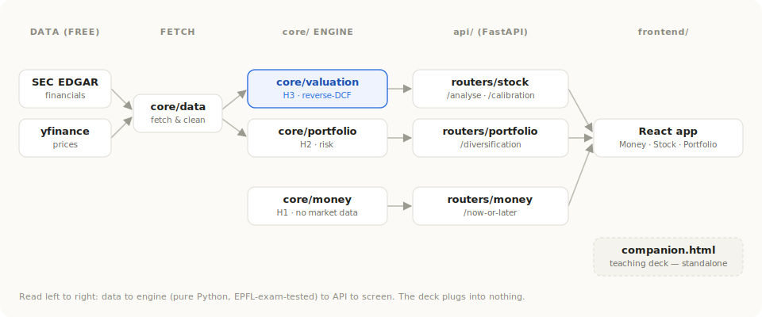
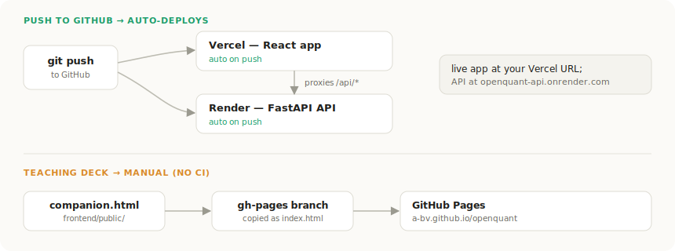

# OpenQuant

OpenQuant turns the EPFL *Principles of Finance* course into something you can play with.

Today it is a deck of **51 cards**. Each card takes one finance idea, shows one picture, and gives you one formula whose numbers you can drag to watch the answer move. Together the cards cover the whole course: compound interest and bonds, risk and portfolios, valuing a company, and options.

It runs as a single web page with nothing to install. Try it live at **https://a-bv.github.io/openquant**, or open `frontend/public/companion.html`.

## Applying it to real companies (in progress)

The other half of the project takes that same finance and points it at real companies. It already pulls live data from two places: **SEC EDGAR** (company financial statements) and **Yahoo Finance** (stock prices).

On top of that data, three tools are taking shape, each built from one part of the course:

| Tool | The question it answers |
|---|---|
| **Money** | Is a lump sum now worth more than payments spread over years? |
| **Portfolio** | You own several stocks. How many independent bets is that really? |
| **Stock** | What future growth does today's share price already assume? |

This half is not finished. The options part of the course, for now, lives only in the cards.

## How it is built



- **`frontend/`**: the React app, plus the standalone card deck (`public/companion.html`).
- **`core/`**: the finance math in plain Python, with no web code, checked against real exam answers.
- **`api/`**: a thin FastAPI layer that serves `core/` to the app.

## Running it

```bash
make install
make dev
```

This starts the API and the app together. Open http://localhost:5173 for the app, or add `/companion.html` for the cards. `make test` runs the checks.

## Deploying



The app (Vercel) and the API (Render) redeploy automatically when you push. Publishing the card deck is the one manual step.

MIT licensed. Built from the EPFL *Principles of Finance* course (Berk and DeMarzo, *Corporate Finance*).
