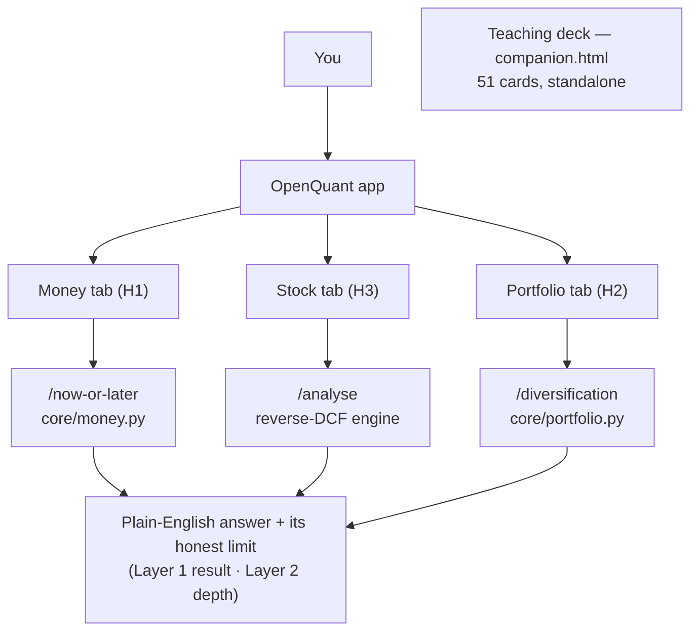
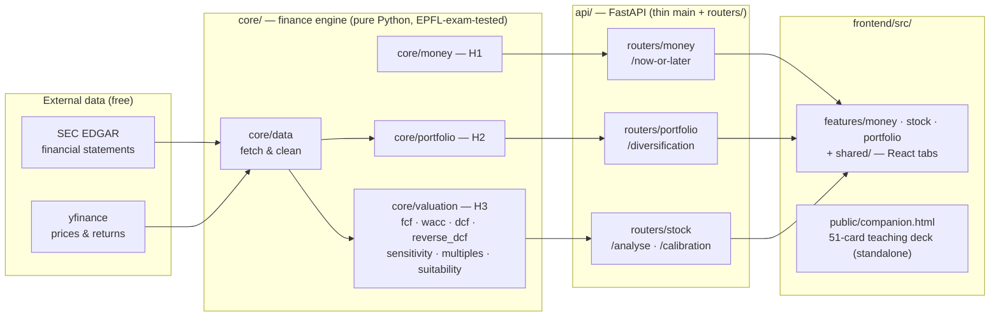
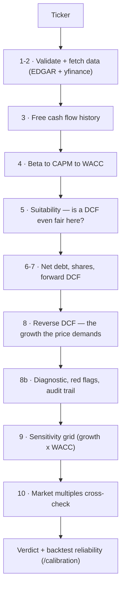
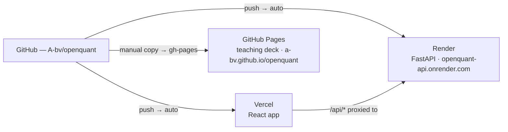

# OpenQuant

**Does the EPFL *Principles of Finance* course actually help in real life? OpenQuant proves it — one course block at a time — on live US market data.**

Each part of the course becomes a small **Lab** that takes real numbers and returns a concrete answer a normal person can act on. It never hands you a formula, and it never claims a false truth.

> **The rule every Lab follows:** never say *"this is worth $X."* Say *"at today's price you are betting on X — do you believe it?"* Every number comes with its honest limit, and is pinned to a worked EPFL exam answer in the test suite.

---

## What it actually is: 3 Labs + a teaching deck

The app (top nav) is three tabs, each one course block applied to real data:

| Tab | Course block | The real-life question it answers | Data |
|---|---|---|---|
| 💵 **Money** *(default)* | H1 · time value of money | "Take the lump sum now, or payments over time?" | none — pure math |
| 📈 **Stock** | H3 · valuation | "What cash-flow growth is today's price already assuming?" | SEC EDGAR + yfinance |
| 🧺 **Portfolio** | H2 · risk & return | "I hold N stocks — how many *independent bets* is that really?" | yfinance |

Alongside the app lives the **teaching deck** (`frontend/public/companion.html`): the whole course as **51 interactive cards** (one idea, one picture, one live formula each). It's standalone — no backend, no build.



---

## The two-layer idea (shared by every Lab)

Each endpoint returns the same shape: a **Layer 1** plain-English result and a **Layer 2** for the depth.

- **`summary_lines`** — the simple answer + a one-line honest caveat (the default view).
- **`detail_lines`** — the theory, the formula, the live computation, the EPFL source.

So a beginner gets *"8 holdings = 1.4 independent bets — you carry more risk than you think,"* and a curious user can open the covariance math behind it.

---

## Architecture

Three clean layers. `core/` holds all the finance math with **zero web dependencies**, so every Lab can be unit-tested against real EPFL exam answers. `api/` exposes it; `frontend/` renders it. The deck sits off to the side.



---

## Inside the Stock lab (the deepest one)

`POST /analyse {"ticker":"AAPL"}` runs the reverse-DCF pipeline. The heart is **step 8**: instead of guessing a value, it solves for the FCF growth the *current price* already assumes — then the app asks if that's believable.



---

## Repository layout

Each lab is self-contained end-to-end — engine → route → UI → test — over thin shared layers.

```text
openquant/
├── core/                   Finance engine — pure Python, no web dependencies
│   ├── common/                 Shared helpers (utils)
│   ├── data/                   Real-data layer: SEC EDGAR + yfinance
│   ├── money/             H1 · time-value-of-money            → /now-or-later
│   ├── portfolio/         H2 · diversification & risk         → /diversification
│   └── valuation/         H3 · reverse-DCF engine             → /analyse
│                              fcf · wacc · dcf · reverse_dcf · sensitivity ·
│                              multiples · suitability · red_flags · audit_trail
├── api/
│   ├── main.py                 Thin app: CORS, /health, mounts routers
│   ├── models.py               Request schemas
│   ├── sanitize.py             JSON-safety helper
│   └── routers/                money.py · portfolio.py · stock.py  (one per lab)
├── frontend/
│   ├── src/App.jsx             Shell + Money/Stock/Portfolio tab routing
│   ├── src/features/           money/ · stock/ · portfolio/  (each lab's UI)
│   ├── src/shared/             SearchBar, Glossary, primitives, hooks
│   └── public/companion.html   51-card EPFL teaching deck — standalone
├── backtest/              "Was the Stock lab right in the past?" — as-of validation
├── tests/                pytest, incl. EPFL exam answer oracles (money/portfolio/exam1/exam2)
└── docs/                 Scope table & course-coverage tracking (openquant_scope_table.xlsx)
```

---

## Deployment (3 independent targets)



- **React app → Vercel** (`frontend/vercel.json`) — auto-deploys on push; proxies `/api/*` to the Render API.
- **API → Render** (`render.yaml`, `Procfile`) — auto-deploys on push.
- **Teaching deck → GitHub Pages** (`gh-pages` branch = `companion.html` copied as `index.html`) — **manual**, no CI:
  ```bash
  git worktree add -B gh-pages /tmp/ghp origin/gh-pages
  cp frontend/public/companion.html /tmp/ghp/index.html
  git -C /tmp/ghp commit -am "update deck" && git -C /tmp/ghp push origin gh-pages
  git worktree remove /tmp/ghp
  ```

---

## Run locally

One-time setup, then a single command runs everything:

```bash
git clone https://github.com/A-bv/openquant && cd openquant
make install     # Python + frontend deps
make dev         # API on :8000  +  app on :5173   (Ctrl-C stops both)
```

Open **http://localhost:5173** — it opens on the **Money** lab; switch tabs for **Stock** and **Portfolio**. The teaching deck is at `http://localhost:5173/companion.html`.

> `make test` runs the suite · `make api` / `make web` start a single side · interactive API docs at `http://localhost:8000/docs`.

---

## Tests & correctness

```bash
make test
```

The course itself is the correctness oracle: `test_money.py`, `test_portfolio.py`, `test_epfl_exam1.py`, and `test_epfl_exam2.py` pin `core/` against **worked answers from real EPFL exams**. Live EDGAR tests are separate because they need network access.

Data: **SEC EDGAR** (financial statements) and **yfinance** (market prices & historical returns).

## License

MIT.
